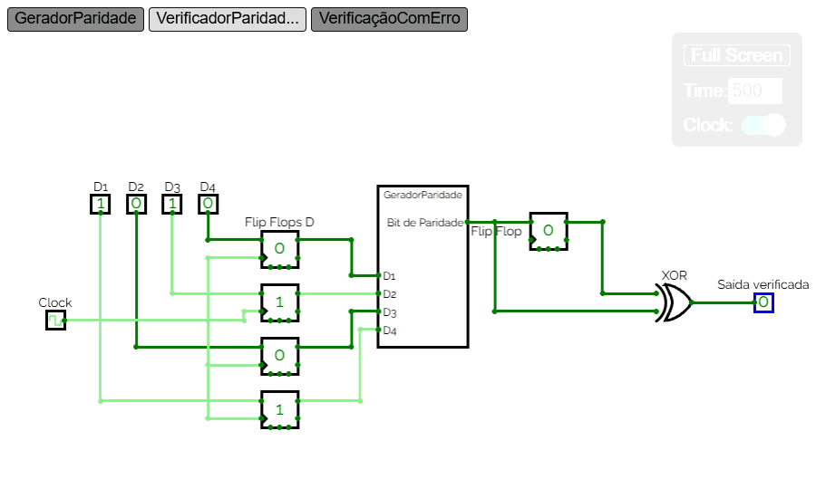
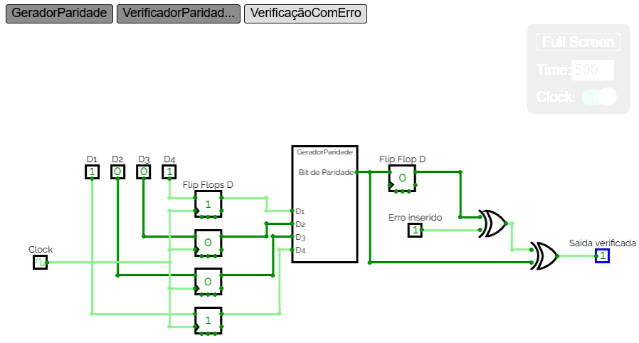

# Projeto de Sistemas Digitais: Métodos de Controle de Erros e Criptografia

Este repositório contém o projeto prático desenvolvido para a matéria de Sistemas Digitais. O objetivo é simular sistemas síncronos de transmissão de dados, aplicando técnicas de detecção e correção de erros utilizando ciclos de clock e armazenamento em Flip-Flops.

## 👥 Integrantes do Grupo
* [João Pedro Costa Cruz] - Responsável pelo Bit de Paridade
* [Edno Bezerra Nascimento Junior] - Responsável pelo Código de Hamming
* [Luciano Ferreira de Queiroz] - Responsável pelo CRC
* [Pedro Henrique Moura Andrade] - Responsável pelo Repetition Code

---

## 1. Bit de Paridade (Síncrono com Injeção de Erro)

### 📌 Introdução Teórica
O método do bit de paridade é uma das formas mais simples de detecção de erros em transmissões digitais. O circuito analisa um bloco de dados e adiciona um bit extra (bit de paridade), garantindo que a quantidade total de bits `1` na mensagem seja sempre PAR (Paridade Par) ou sempre ÍMPAR (Paridade Ímpar).

Ele é um método de criptografia pois empacota uma mensagem com dígitos de paridade para validação, recepção de mensagem criptografada e desempacotamento da mensagem.

Circuitos geradores de paridade dispensam a necessidade de simplificações por Mapas de Karnaugh, pois sua lógica é constituída fundamentalmente por portas XOR aninhadas em cascata para todas as suas entradas. 

### 🛠️ Implementação em Hardware (CircuitVerse)
Para garantir o comportamento síncrono exigido, o circuito foi dividido em blocos bem definidos utilizando componentes nativos do **CircuitVerse**:

1. **Registrador de Entrada:** 4 Flip-Flops D armazenam os bits de dados ($D_3, D_2, D_1, D_0$) de forma síncrona, controlados por um sinal de Clock comum gatilhado por borda de subida.
2. **Gerador combinacional:** Um subcircuito composto por portas XOR calcula a paridade ideal para as entradas armazenadas.
3. **Flip-Flop de Paridade:** Um quinto Flip-Flop D armazena o bit de paridade gerado, simulando o dado pronto para envio.

### 🧪 Cenários de Teste

#### Cenário A: Transmissão Normal (Sem Erros)
Quando o sistema opera em modo convencional, a paridade calculada pelo transmissor coincide com a checagem no receptor. A saída final calibrada resulta em `0` (Sinal Verde), indicando transmissão bem-sucedida.

#### Cenário B: Teste com Injeção de Erro
Uma porta XOR intermediária foi adicionada à saída do quinto Flip-Flop, controlada por uma chave manual (`Err`). Ao ativar essa chave ($1$), forçamos a inversão do bit de paridade original, simulando um ruído no canal de comunicação. O receptor identifica instantaneamente a divergência e altera a saída final para `1` (Erro Detectado).

---
*Próximas etapas do projeto (Hamming, CRC e Repetition) serão adicionadas nas seções seguintes.*