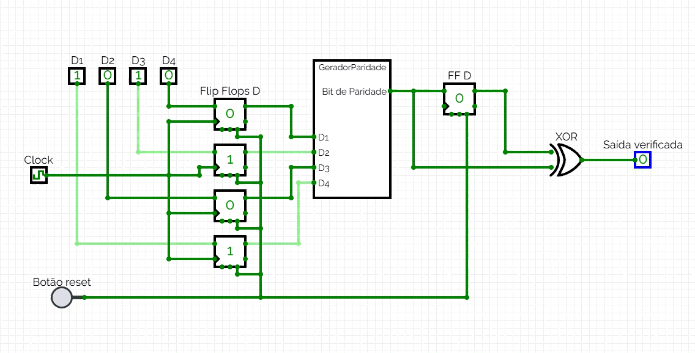
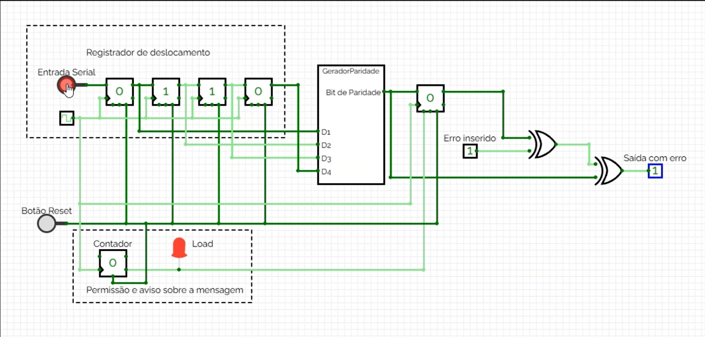
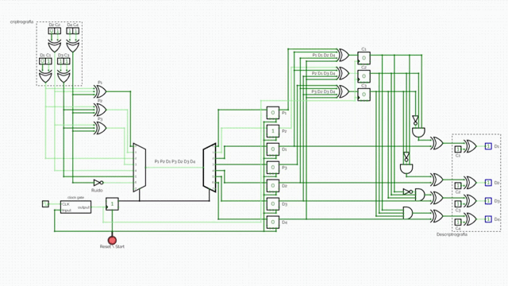
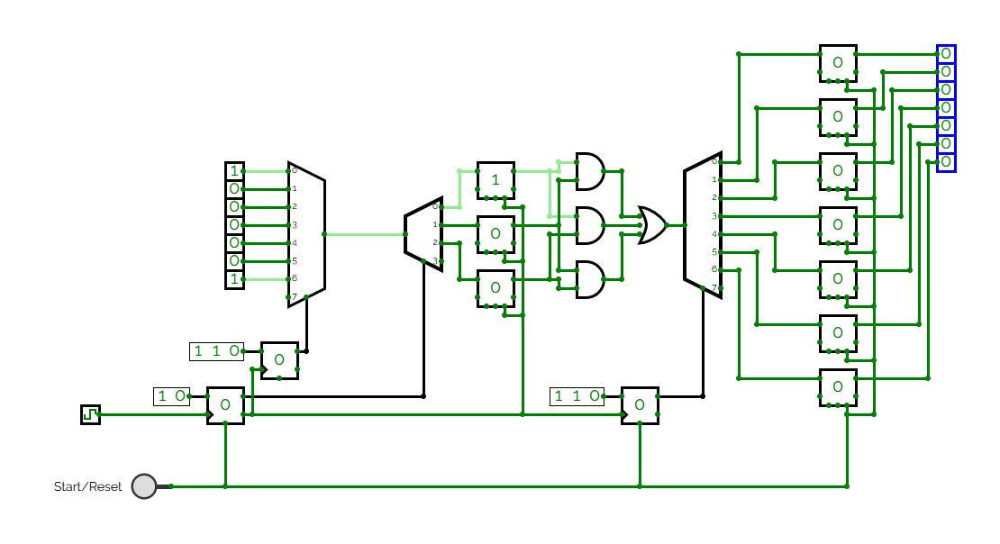
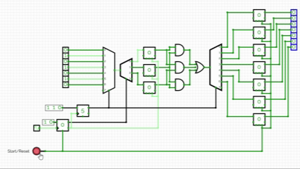
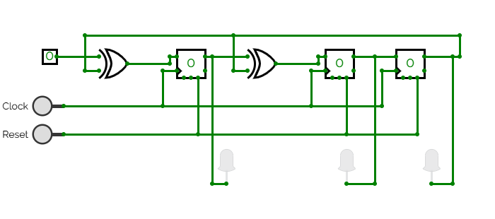
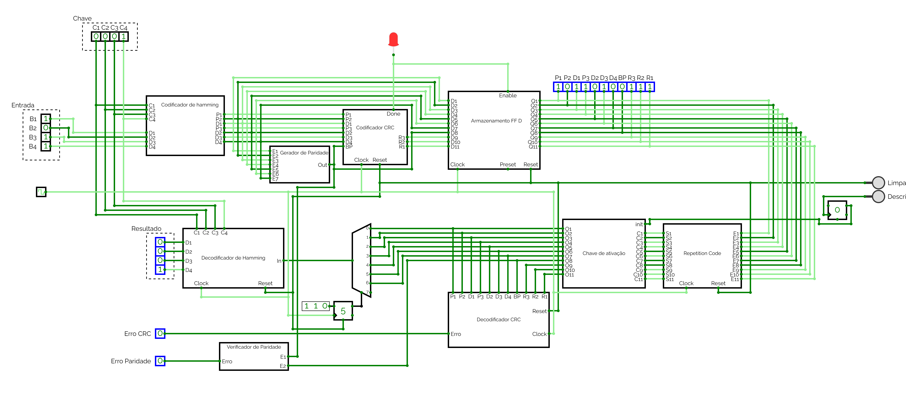

# Projeto de Sistemas Digitais: Métodos de Controle de Erros e Criptografia

Este repositório contém o projeto prático desenvolvido para a matéria de Sistemas Digitais. O objetivo é simular sistemas síncronos de transmissão de dados, aplicando técnicas de detecção e correção de erros utilizando ciclos de clock e armazenamento em Flip-Flops.

## 👥 Integrantes do Grupo
* [João Pedro Costa Cruz] - Responsável pelo Bit de Paridade
* [Edno Bezerra Nascimento Junior] - Responsável pelo Código de Hamming
* [Luciano Ferreira de Queiroz] - Responsável pelo CRC
* [Pedro Henrique Moura Andrade] - Responsável pelo Repetition Code e implmentação do Circuito Completo

---

## 1. Bit de Paridade (Síncrono com Injeção de Erro)

### 📌 Introdução Teórica
O método do bit de paridade é uma das formas mais simples de detecção de erros em transmissões digitais. O circuito analisa um bloco de dados e adiciona um bit extra (bit de paridade), garantindo que a quantidade total de bits `1` na mensagem seja sempre PAR (Paridade Par) ou sempre ÍMPAR (Paridade Ímpar).

Ele é um método de criptografia pois empacota uma mensagem com dígitos de paridade para validação, recepção de mensagem criptografada e desempacotamento da mensagem.

Circuitos geradores de paridade dispensam a necessidade de simplificações por Mapas de Karnaugh, pois sua lógica é constituída fundamentalmente por portas XOR aninhadas em cascata para todas as suas entradas. 

### 🛠️ Implementação em Hardware (CircuitVerse)
Para garantir o comportamento síncrono exigido, o circuito foi dividido em blocos bem definidos utilizando componentes nativos do **CircuitVerse**:

1. **Registrador de Entrada:** 4 Flip-Flops D armazenam os bits de dados ($D_3, D_2, D_1, D_0$) de forma síncrona, controlados por um sinal de Clock comum gatilhado por borda de subida.
2. **Gerador combinacional:** Um subcircuito composto por portas XOR calcula a paridade ideal para as entradas armazenadas.
3. **Flip-Flop de Paridade:** Um quinto Flip-Flop D armazena o bit de paridade gerado, simulando o dado pronto para envio.

### 🧪 Cenários de Teste

#### Cenário A: Transmissão Normal (Sem Erros)
Quando o sistema opera em modo convencional, a paridade calculada pelo transmissor coincide com a checagem no receptor. A saída final calibrada resulta em `0` (Sinal Verde), indicando transmissão bem-sucedida. Feito com entradas paralelas para exemplificar como seria.

#### Cenário B: Teste com Injeção de Erro
Uma porta XOR intermediária foi adicionada à saída do quinto Flip-Flop, controlada por uma chave manual (`Err`). Ao ativar essa chave ($1$), forçamos a inversão do bit de paridade original, simulando um ruído no canal de comunicação. O receptor identifica instantaneamente a divergência e altera a saída final para `1` (Erro Detectado). Montado com registrador de deslocamento para deixar mais sofisticado e próximo da realidade.

---

## 2. Transmissor de Hamming

### 📌 Introdução Teórica
O circuito transmissor de Hamming utiliza múltiplos bits de paridade para realizar a detecção de possíveis falhas ocasionadas por ruídos durante o processo de transmissão. Existem diferentes variações do circuito com a capacidade de lidar com diferentes tamanhos de entrada. No caso do transmissor Hamming (7,4), ele lida com entradas de 4 bits, acrescentando mais 3 bits de paridade ao conjunto de dados antes de realizar o envio das informações. Após receber a mensagem, novos cálculos de paridade são realizados para calcular os valores críticos ($C_1, C_2, C_3$) e determinar possíveis alterações nos dados. Caso o cálculo de todos resulte em zero, a mensagem não possui erros; do contrário, o número binário formado pelos valores críticos indica a posição exata do bit que sofreu variação.

De modo atípico, o circuito desenvolvido possui mais uma camada de segurança (criptografia) utilizando uma chave simétrica e portas XOR para inverter o valor de certos bits de entrada.

### 🛠️ Implementação em Hardware (CircuitVerse)

1. **Gerador de bits de paridade:** 3 portas XOR de 3 entradas, responsáveis por calcular a paridade de 3 subconjuntos distintos dos dados de entrada;
2. **Envio sequencial dos bits:** os valores de entrada ($D_1, D_2, D_3, D_4$) e os bits de paridade ($P_1, P_2, P_3$) alimentam um circuito multiplexador (MUX) que envia cada bit conforme o sinal de clock;
3. **Recebimento:** Um circuito demultiplexador (DEMUX) recebe os bits enviados pelo MUX e os armazena em 7 flip-flops SR;
4. **Detecção de falhas:** Os dados armazenados nos flip-flops são utilizados em um novo cálculo de paridade, por meio de portas XOR de 4 entradas, para determinar os valores críticos ($C_1, C_2, C_3$) que são armazenados em 3 flip-flops do tipo D;
5. **Correção de falhas:** Os valores críticos são enviados para conjuntos de portas AND e NOT que antecedem portas XOR ligadas a cada flip-flop de dados. O conjunto das portas AND e NOT faz com que os valores críticos sejam decodificados para acionar a porta XOR específica que realiza a inversão do dado alterado;
6. **Criptografia:** Um conjunto de 4 portas XOR, aplicado aos dados de entrada e a uma chave de criptografia, realiza a inversão de alguns bits de dados antes da transmissão. Como essa inversão ocorre antes do cálculo do Hamming (ou é aplicada de forma que o circuito a considere como o dado original), ela não é detectada como erro pelo circuito transmissor de Hamming; desse modo, os dados são transmitidos e armazenados ainda criptografados. Um segundo conjunto de portas XOR, localizado no final do circuito, realiza a descriptografia dos dados, desde que a chave utilizada seja a mesma usada no processo de criptografia.

### 🧪 Cenários de Teste

#### Cenario A: Simulação de ruido com porta NOT:
Uma porta NOT aplicada ao ultimo valor de entrada antes do circito de envio de dados mas após o calculo dos bits de paridade simula a inversão de valor resultante de um ruido durante a transmissão.

.

---

## 3.  Repetition Code

### 📌 Introdução Teórica
A trasmissão por código de repetição se baseia na repetição dos bits de dados transmitidos. Ou seja, cada bit de informação é peretido multiplas vezes, e na recepção do sinal o valor majoritário é assumido. Desse modo, o circuito corrige erros pontuais na transmissão, apesar de aumentar o tempo de transmissão e a largura de banda de forma diretamente proporcional ao número de repetições feitas por bit.

### 🛠️ Implementação em Hardware (CircuitVerse)

1. **Portas Lógicas Combinacionais:** 1 porta OR de 3 entradas e 3 portas AND de 2 entradas por estágio, utilizadas para a lógica de teste de maioria (majority voting).
2. **Elementos de Lógica Sequencial:** 3 Flip-flops do tipo D (atuando como registradores de recepção temporária) e 7 Flip-flops do tipo SR (como unidades dearmazenamento definitivo das saídas).
3. **Dispositivos de Seleção e Fluxo:** 1 circuito Multiplexador (MUX) de 8 canais e 2 circuitos Demultiplexadores (DEMUX) configurados para 4 e 8 canais, respectivamente.
4. **Unidade de Temporização e Controle:** 2 contadores binários (counters) síncronos — um de 3 bits (divisor por 8) e um de 2 bits (divisor por 4) — associados a um gerador de clock comum de 2 Hz (período de 500 ms).

### 🧪 Cenários de Teste

#### Cenario A: Transmissão sem ruído
Nota-se que são necessários 21 ciclos de clock para transmitir a cadeia de bits por completo. Com frenquência de 2Hz são 10,5 segundos.

---

## CRC ( Cyclic Redudancy Check)

### 📌 Introdução Teórica
Baseia-se na aplicação de uma divisão polinoial matemática sobre o bloco de dados utilizando aritmética de módulo 2. O resto dessa divisão é anexado à mensagem e transmitido sequencialmente. Na recepção, circuitos de lógica sequencial baseados em registradores de deslocamento(LFSR) processamo fluxo e verificam o resto; embora apresente maio complexidade de hardware, o método é extremamente robusto para detectarrajadas de erros em pacotes extensos.

### 🛠️ Implementação em Hardware (CircuitVerse)
1. **Entrada Serial (Input):** Pino por onde o fluxo de dados (mensagem) é injetadono sistema, processando um bit por ciclo de clock.
2. **3 Flip-Flops Tipo D:** Atuam como os registradores de estado do sistema, armazenando o resto parcial da divisão a cada ciclo. A quantidade de Flip-Flops (três) é diretamente proporcional ao grau do polinômio gerador (x3).
3. **2 Portas Lógicas XOR:** Responsáveis por executar a operação matemática de subtração em aritmética de Módulo-2 sem a propagação de transporte (carry).
4.  **Sinais de Controle:**
    - Clock: Sincroniza o deslocamento dos bits através dos Flip-Flops.
    - Reset: Inicializa todos os Flip-Flops no estado lógico baixo (0) antes de uma nova transmissão.
6.  **3 LEDs de Saída:** Conectados às saídas Q de cada Flip-Flop para a visualização do código CRC final armazenado (resto da divisão).

---

## Circuito Completo

Circuito central que integra os demais subcircuitos de encapsulamento e transmissão de forma combinada, realizando a transferência de dados através de múltiplas camadas sucessivas de proteção e criptografia. O dado em trânsito sofre diversos processamentos lógicos antes do envio para o meio físico, tornando-se estruturalmente complexo e, portanto, incompreensível para observadores externos (confidencialidade)

### 📊 Parâmetros
O circuito foi projetado para atender aos seguintes parâmetros lógicos e estruturais estabelecidos:

* Tamanho do dado original: 4 bits (D1,D2,D3,D4).
* Camadas de processamento (Transmissor): Criptografia Simétrica → Código de Hamming (7,4) → Bit de Paridade → Verificação de Redundância Cíclica (CRC) → Código de Repetição.
* Evolução do Quadro (Frame): O encapsulamento sucessivo expande a palavra original: 4 bits de dados → 7 bits (Hamming) → 8 bits (Paridade) → 11 bits (CRC) → 33 bits transmitidos (após Repetição R = 3)

### 🧩Componentes
Para elaborar o datapath do sistema integrado, foram instanciados os seguintes módulos de circuito apresentados e validados nas seções anteriores.

A. Código de Hamming
* Codificador de Hamming: Realiza a criptografia via protas XOR e empacotamento primário com 3 bits de paridade para correção de erro único(SEC).
* Decodificador de Hamming: Efetua o cálculo da síndrome matricial, correção física do bit avariado e posterior descriptografia geométrica.

B. Bit Paridade
* Gerador de Paridade: Módulo Combinacional de portas XOR que adiciona 1 bit de redundância ao quadro do Hamming para garantir quantidade de par de bits em nível lógico alto.
* Verificador de Paridade: Confirma a simetria par no receptor, atuando como uma camada rápida de detecçãao de erros simples pós-decodificação.

C. Código de Repetição
* Módulo Replicador (Transmissão): Multiplica a base de tempo da transmissão, sustentando cada bit do pacote CRC por 3 ciclos de clock consecutivos na linha serial.
* Módulo Votador(Majority Voter): Aplica a lógica booleana de decisão por maioria no receptor para filtrar e suprimir ruídos impulsivos antes da verificação cíclica.

D. Verificação de Redundância Cíclica (CRC)
* Codificador CRC (LFSR): Executa a divisão polinomial em Módulo-2 do bloco de 8 bits e anexa o resto de 3 bits ao final do pacote.
* Decodificador CRC (LFSR): Reprocessa os 11 bits recebidos; a ausência de rajadas de erros (burst errors) é atestada matematicamente quando o resto final nos registradores é estritamente 0002.

E. Módulos Adicionais de Controle
* Unidade de Armazenamento Intermediária: Malha de Flip-flops do tipo D acionados por borda de subida, utilizada para registrar e estabilizar os dados temporalmente após o processamento lógico dos codificadores, garantindo sincronismo.
* Chave de Ativação (Clock Gating): Módulo de controle de fluxo que gerencia a base de tempo global. Ele limita e janela a passagem do sinal de temporização para o meio físico e para os módulos de decodificação apenas quando o pacote completo está pronto para trânsito
